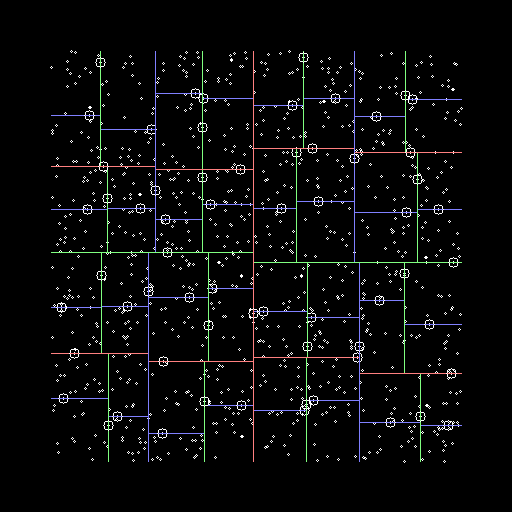
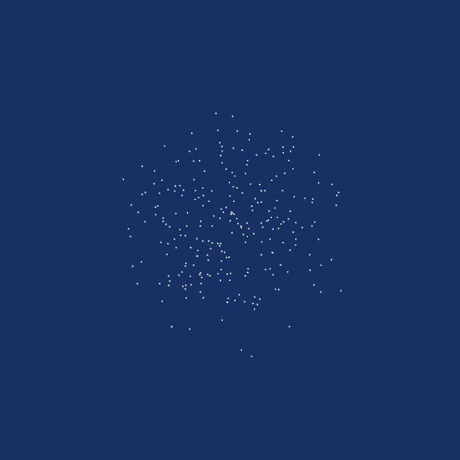

# KdTree

Simple KDTree implementation.

## Visualization (2D)



## Visualization (3D)



## Sample terminal output

```bash
Seed = 1586647645690064332
me    222.015346 ms
dummy 66541056
nano  107.369828 ms
dummy 66541056
me        1023 453 579 606 240 352 365 273 500 400 619 144 884 987 359 225 7
nanoflann 1023 453 579 606 240 352 365 273 500 400 619 144 884 987 359 225 7
```
